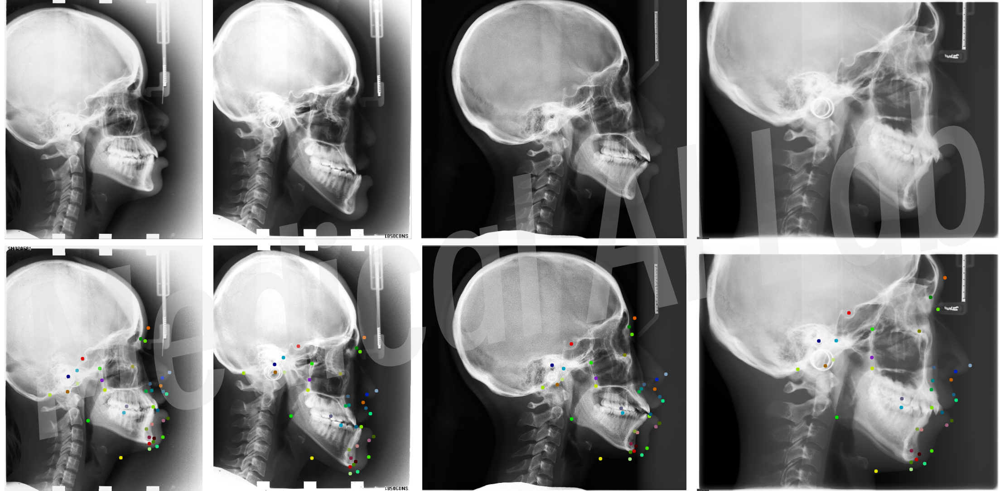

# CL-Detection 2023挑战赛基线模型（基于MMPose框架）

这个仓库提供了一个基于MMPose框架的的解决方法，让大家都可以更方面进行切换使用流程中的各个组件；同时，该仓库也提供了docker镜象的封装的教程，可以保证大家能够把自己算法模型上传到排行榜进行验证（欢迎加入QQ交流答疑群：808896849）！

**奖励**：前三名将获得500欧元的奖金和证书，同时我们也邀请其他优胜团队2023年10月在 MICCAI 会议现场做口头报告，并作为 CO-author 在领域顶刊（MedlA或TMI）投稿期刊论文，欢迎大家报名参加呀👏（截止时间为 2023年8月1日）！

**复现**：大家都知道把大象放冰箱分 3 步，本仓库的代码共分为了 6 步，每一步都可以说有详细指导，您按照下面的教程来一步一步地复现本仓库结果或者定制自己的模型，完全是轻而易举的事情，因为该踩的坑我都帮大家踩了，大家直接冲就对了！

**提醒**：此仓库采用MMPose框架进行模型的构建，还请保证自己对此框架有一定的了解，亦或者参考另一个仅基于 Pytorch 搭建的热图回归的仓库[**CL-Detection2023**](https://github.com/szuboy/CL-Detection2023)，仓库代码均包含详细的中文代码注释，可按需自取：
[[挑战赛官网😆](https://cl-detection2023.grand-challenge.org)]
[[挑战赛排行榜🏆](https://cl-detection2023.grand-challenge.org/evaluation/challenge/leaderboard/)]
[[ENGLISH README👀](README-EN.md)]


## 第一步：安装使用

**（1）配置好相关的依赖环境：** 使用 MIM 安装 MMEngine 和 MMCV，保证工程中的 MMPose 的源码自定义安装能够顺利完成安装和使用：
```
pip install -U openmim
mim install mmengine
mim install "mmcv>=2.0.0"
```

**（2）下载本仓库提供的代码：** 本仓库是下载的是主分支的 MMPose V1.0.0（Pytorch版本1.8+），可直接通过 Git 克隆本仓库或者是右上角的 Download ZIP 即可，再进行安装操作 MMPose；
这是因为本仓库提供的 MMPose 代码增加了适配挑战赛的数据集 `CephalometricDataset` 和 `CephalometricMetric` 类，可以大家的使用体验更加丝滑。如果您现有的 Pytorch 版本不适配，可通过 `conda` 创建一个虚拟环境来完美兼容，具体可参考 [MMPose安装教程](https://mmpose.readthedocs.io/en/latest/installation.html#installation)中的虚拟环境建立。
```
git clone https://github.com/szuboy/CL-Detection2023-MMPose.git
cd CL-Detection2023-MMPose/mmpose_package/mmpose
pip install -r requirements.txt
pip install -v -e .
# "-v" 表示输出更多安装相关的信息
# "-e" 表示以可编辑形式安装，这样可以在不重新安装的情况下，让本地修改直接生效
```

**（3）测试上述安装是否正常：** 可执行 [`step1_test_mmpose.py`](step1_test_mmpose.py) 测试脚本来进行验证上述操作已经成功执行，能够正常使用 MMPose 进行模型的训练和测试，预期结果将得到对应的版本输出：
```python
import mmpose
print(mmpose.__version__)
# 预期输出结果： 1.0.0
```


## 第二步：数据准备

**（1）训练数据获取：** 您应该提前下载好挑战赛提供的训练数据的图像和标注的文件，可参考挑战赛官网的[详细指导](https://cl-detection2023.grand-challenge.org/)，具体来说：您仅需要发送[注册表文件](https://drive.google.com/file/d/1wW9W6rkwJmZz9F3rWCNxK0iECbRSb55q/view?usp=sharing)到对应的邮件，拿到数据的可访问链接。放心，我们会快速审核通过的，或者加入官方的QQ交流答疑群：808896849，群主一直在很耐心地帮大家解决问题。

**（2）数据的预处理：** 对于 CL-Detection 2023挑战赛的数据集，组织方考虑到存储的支出和分发的便利，所有图像都进行0填充到统一的大小尺度(2400, 2880, 3)。因此，都有一些不相关的区域需要删除，并生成 MMPose 框架的要求的 JSON 文件格式，这个预处理脚本的主要功能就是处理这两个问题。

在这一步中，您可以执行脚本 [`step2_prepare_coco_dataset.py`](step2_prepare_coco_dataset.py) 来自动执行上述操作，您可以用以下两种方案进行数据的预处理，其中 `train_stack.mha` 是挑战赛提供的图像数据，含有400张头影图像；`train-gt.json` 是挑战赛提供的标注文件：

1、在脚本 [`step2_prepare_coco_dataset.py`](step2_prepare_coco_dataset.py) 中修改或者设置以下数据访问路径参数和结果保留路径，再运行该脚本即可：

```python
parser = argparse.ArgumentParser()

# data parameters
parser.add_argument('--mha_file_path', type=str, default='/data/zhangHY/CL-Detection2023/train_stack.mha')
parser.add_argument('--train_gt_path', type=str, default='/data/zhangHY/CL-Detection2023/train-gt.json')

# save processed images dir path
parser.add_argument('--image_save_dir', type=str, default='/data/zhangHY/CL-Detection2023/MMPose')

experiment_config = parser.parse_args()
main(experiment_config)
```

2、在终端中使用以下命令传输参数，再运行脚本，同样也是支持的：

```
python step2_prepare_coco_dataset.py \
--mha_file_path='/data/zhangHY/CL-Detection2023/train_stack.mha' \
--train_gt_path='/data/zhangHY/CL-Detection2023/train-gt.json' \
--image_save_dir='/data/zhangHY/CL-Detection2023/MMPose'
```

代码运行后，您会得到一个去除零填充的图像的文件夹和三个 JSON 文件。此仓库采取**训练-验证-测试**的模式，模型在训练集上进行训练，在验证集上进行模型训练和超参数的选择，然后在测试集上测试得到最终的模型性能表现。

现有的划分逻辑是将400张图像随机划分，其中：训练集300张图像，验证集和测试集各50张图。当然，您可以按照您的想法来进行划分，不必按照这个模式来操作，比如：只划分训练集和验证集，以此来增加训练集的照片数量，这或许可以提升模型的性能表现。

**注意：** 为了适配 MMPose 框架的要求，我们需将 CL-Detection2023 挑战赛提供的训练数据及其对应的标注文件转换为采用的类似于 COCO 格式，然后进行解析。其中唯一不同的是：我们在 `image` 的信息中增加了像素间的距离 `spacing` 键值，此指类似一个“比例尺”作用，进行像素距离和物理距离换算，以保证后续的指标计算。

同时，或许细心的你也注意到，没有注意到的，我们也必须指出：目前的生成 JSON 数据文件中的 `bbox` 键的检测框的坐标值默认是图像的宽高大小，这种设置出发点的主要考虑的因素有两个：

- 挑战赛测试的时候仅仅只会提供输入图像矩阵，其他信息是没有的，为了适配 MMPose 框架的 `TopdownPoseEstimator` 检测器，默认是整个图像的大小作为检测框，可以更快速地使用各种模块进行组合寻优。
- 根据 2021 年发表在 MedAI 期刊的[论文研究](https://www.sciencedirect.com/science/article/pii/S1361841520302681)表明：级联的方式可以实现更好的效果。这是让大家优化的时候更加从容：或许在前面来一个检测网络确定大概的关键点区域再进行定位，也许就是性能提高的制胜法宝。

```
"images": [
    {
        "id": 104,
        "file_name": "104.png",
        "width": 1935,
        "height": 2400,
        "spacing": 0.1
    }
    ...
]

"annotations": [
    {
        "id": 104,
        "image_id": 104,
        "category_id": 1,
        "keypoints": [...],
        "iscrowd": 0,
        "bbox": [
            0,
            0,
            1935,
            2400
        ],
        "area": 4644000
    },
    ...
]
```

如果到了这里，恭喜您，你已经成功了一半了。到现在，我们已经有了图像数据和准备好符合 MMPose 的配置文件，相信接下来就是您的主场，可以随意的在 MMPose 上进行组合寻优，在排行榜上占据一席之地🔥。


## 第三步：模型训练

笔者在这里已经提供了一个基于 `HRNet` 的基线模型的完整配置文件在 `cldetection_configs` 文件夹中，几乎所有的配置项都在上面任君配置，然后按照您使用 `MMPose` 的经验来操作使用，简直是无缝切换呀~

记得别忘了修改配置文件中的数据根目录呀，目前配置文件中的路径暂时是作者自己服务器上的配置，还请修改为对应自己平台的数据路径嘞：

```
dataset_type = 'CephalometricDataset'
data_mode = 'topdown'
data_root = '/data/zhangHY/CL-Detection2023'  # 修改为自己平台上对应的数据路径目录
```

放心哈，本仓库提供的 [`step3_train_and_evaluation.py`](step3_train_and_evaluation.py) 文件其实就是 MMPose 下的 `tools/train.py` 文件，只是重新命名文件名，让大家的逻辑更加清晰，因此，您可以直接这么使用进行训练验证：

```
CUDA_VISIBLE_DEVICES=0 python step3_train_and_evaluation.py \
cldetection_configs/td-hm_hrnet-w32_udp-8xb64-250e-512x512_KeypointMSELoss.py \
--work-dir='/data/zhangHY/CL-Detection2023/MMPose-checkpoints' 
```

执行完后，你将可能看到如下所示的输出信息，以及模型在验证集数据上的一些评价指标，对应的模型权重将您指定的 `--work-dir` 保存路径中，可以去查看到对应的权重文件。

```
06/28 03:16:23 - mmengine - INFO - Epoch(train)   [1][ 1/38]  lr: 5.000000e-07  eta: 15:19:03  time: 5.805217  data_time: 1.997265  memory: 8801  loss: 0.010580  loss_kpt: 0.010580  acc_pose: 0.000000
06/28 03:16:24 - mmengine - INFO - Epoch(train)   [1][ 2/38]  lr: 1.501002e-06  eta: 8:38:45  time: 3.277006  data_time: 1.012852  memory: 9545  loss: 0.010586  loss_kpt: 0.010586  acc_pose: 0.003289
06/28 03:16:24 - mmengine - INFO - Epoch(train)   [1][ 3/38]  lr: 2.502004e-06  eta: 6:23:50  time: 2.425048  data_time: 0.683300  memory: 9545  loss: 0.010585  loss_kpt: 0.010585  acc_pose: 0.000000
...
06/28 03:17:27 - mmengine - INFO - Epoch(train)   [2][38/38]  lr: 7.557515e-05  eta: 2:24:11  time: 0.868173  data_time: 0.190205  memory: 5290  loss: 0.008559  loss_kpt: 0.008559  acc_pose: 0.960526
06/28 03:17:27 - mmengine - INFO - Saving checkpoint at 2 epochs
06/28 03:17:35 - mmengine - INFO - Epoch(val)   [2][ 1/13]    eta: 0:00:17  time: 1.422160  data_time: 1.269009  memory: 1233  
06/28 03:17:35 - mmengine - INFO - Epoch(val)   [2][ 2/13]    eta: 0:00:08  time: 0.775162  data_time: 0.637363  memory: 1233
...
06/28 03:17:39 - mmengine - INFO - Evaluating CephalometricMetric...
=> Mean Radial Error        :  MRE = 5.017 ± 6.976 mm
=> Success Detection Rate   :  SDR 2.0mm = 19.211% | SDR 2.5mm = 28.789% | SDR 3mm = 39.000% | SDR 4mm = 56.737%
06/28 03:17:39 - mmengine - INFO - Epoch(val) [2][13/13]  MRE: 5.017320  SDR 2.0mm: 19.210526  SDR 2.5mm: 28.789474  SDR 3.0mm: 39.000000  SDR 4.0mm: 56.736842data_time: 0.274684  time: 0.42305
```

如果您想知道更多的配置选择可以参考对应的 [MMPose文档](https://mmpose.readthedocs.io/en/latest/user_guides/train_and_test.html#train-with-your-pc)，或者是毫不吝啬地在这里的 [Issues](https://github.com/szuboy/CL-Detection2023-MMPose/issues) 中提出来，亦可以加入挑战赛的群聊向我（群主）提出来，请放心哈，我会耐心给大家解决问题滴~

### 注意事项

不过这份配置文件中，有几个重点很值得强调一下，让大家慎重修改的部分，避免让大家掉进坑里面去，也使得大家修改配置的时候更加的炉火纯青，也还请不要轻易修改，如果您不知道背后的原理：

**（1）保存模型权重依据：** 默认保存模型 `checkpoints` 的依据是 `SDR 2.0mm` 评价指标，这是一个自定义的评价指标，官方的 MMPose 中是没有的，但是该仓库的修改后版本中已经带有，可放心食用，对应着下面的这段配置代码：

```python
default_hooks = dict(
    timer=dict(type='IterTimerHook'),
    logger=dict(type='LoggerHook', interval=1),
    param_scheduler=dict(type='ParamSchedulerHook'),
    checkpoint=dict(
        type='CheckpointHook',
        interval=2,
        save_best='SDR 2.0mm',
        rule='greater'),
    sampler_seed=dict(type='DistSamplerSeedHook'),
    visualization=dict(type='PoseVisualizationHook', enable=False))

val_evaluator = dict(
    type='CephalometricMetric')
```

`SDR 2.0mm` 也是挑战赛排行榜上的评价指标，因此我暂时使用它作为 `save_best` 的依据；当然，您也可以选择另外一个排行榜上的评价指标 `MRE`，或者其他的 `SDR 2.5mm`、`SDR 3.0mm` 和 `SDR 4.0mm` 作为保存最好模型的依据。
不过注意喔，如果选择了 `MRE` 作为保存的依据，记得将 `rule` 修改为 `rule='less'`，因为我们当然是希望误差越来小啦。

补充：`MRE` 的全称是 `Mean Radial Error`，指的是预测点和真实点之间的欧几里得距离（有乘上对应的像素之间的距离 `spacing`）；
`SDR 2.0mm`，`SDR 2.5mm`，`SDR 3.0mm` 和 `SDR 4.0mm` 指的是所有预测点落在对应真实关键点距离 `{}mm` 的比例。比如，`SDR 2.0mm = 19.211%` 表示所有图像的所有点有 `19.211%` 的点定位在真实的关键点 `2mm` 范围内，这个值越高越好。

**（2）数据类型兼容使用：** CL-Detection2023 挑战赛为每一张图像都标注了 38 个关键点，MMPose 框架现有的数据配置不兼容，因此，为了大家不折腾这些数据配置信息，本仓库的 MMPose 版本已经进行了兼容实现，可直接使用：

```python
dict(type='PackPoseInputs', meta_keys=('id', 'img_id', 'img_path', 'category_id', 'crowd_index', 'ori_shape',
                                       'img_shape', 'input_size', 'input_center', 'input_scale', 'flip',
                                       'flip_direction', 'flip_indices', 'raw_ann_info', 'spacing'))


dataset_type = 'CephalometricDataset'
data_mode = 'topdown'
data_root = '/data/zhangHY/CL-Detection2023'
```

重要的事情说三遍，记得每一个 `PackPoseInputs` 后面的 `meta_keys` 添加上对应的这些键，特别是 `spacing`，不然就会报错，导致评价指标将无法进行计算。

好了，现在完全可以开始定制属于自己的配置文件了。由于我们的数据集是基于 COCO 格式的，所以，您可以参考 MMPose 框架下 `configs/body_2d_keypoint/topdown_heatmap/coco`的自带的配置文件进行任意配置（到了这里，项目进度80%🥳）。


## 第四步：测试和可视化预测结果

在这里，您可以运行脚本 [`step4_test_and_visualize.py`](step4_test_and_visualize.py) 来对训练好的模型进行独立的测试，看看性能表现如何，并可视化图片的38个关键点的预测结果。具体来说，您可以终端中这么操作：

```
CUDA_VISIBLE_DEVICES=0 python step4_test_and_visualize.py \
cldetection_configs/td-hm_hrnet-w32_udp-8xb64-250e-512x512_KeypointMSELoss.py \
'/data/zhangHY/CL-Detection2023/MMPose-checkpoints/best_SDR 2.0mm_epoch_40.pth' \
--show-dir='/data/zhangHY/CL-Detection2023/MMPose-visualize' 
```

稍等一会，运行完脚本后，可以观察到模型在独立测试集上的 `MRE` 和 `SDR` 一系列指标的性能表现。下面表格是作者尝试的不同配置的性能结果，仓库代码未固定随机种子，如果复现结果与作者提供的实验结果有一点点偏差，这是正常的。同样地，可以在可视化文件夹下观察到一些关键点预测结果的可视化（小声BB吐槽一句：可视化的点小，还请放大来观察；只有预测点，没有同时和真实关键点进行对比）。

放心哈，这个脚本也是 MMPose 框架下 `tools/test.py` 脚本重命名后的脚本名字，可以让大家更容易的理解和使用，想要知道更多的配置和使用方案，可以参考具体的[使用文档](https://mmpose.readthedocs.io/en/latest/user_guides/train_and_test.html#test-your-model)，或者是加入我们的官方交流答疑群，保证包教包会。


| Arch                                                                                                       | Input Size |   MRE (mm)    | SDR 2.0mm (%) | SDR 2.5mm (%) | SDR 3.0mm (%) | SDR 4.0mm (%) |                                               ckpt                                                |                                               log                                               |
|------------------------------------------------------------------------------------------------------------|:----------:|:-------------:|:-------------:|:-------------:|:-------------:|:-------------:|:-------------------------------------------------------------------------------------------------:|:-----------------------------------------------------------------------------------------------:|
| [HRNet + AdaptiveWingLoss](cldetection_configs/td-hm_hrnet-w32_udp-8xb64-250e-512x512_AdaptiveWingLoss.py) | 512 × 512  | 2.258 ± 5.935 |    66.000     |    75.421     |    82.737     |    91.000     |    [ckpt](https://drive.google.com/file/d/11zBGGzYpUbpYxyMkDfYcqPnSZuhGxVY2/view?usp=sharing)     |    [log](https://drive.google.com/file/d/1Gw9tObsETbqyM5EoCVTDauQncXjv4lqN/view?usp=sharing)    |
| [HRNet + KeypointMSELoss](cldetection_configs/td-hm_hrnet-w32_udp-8xb64-250e-512x512_KeypointMSELoss.py)              | 512 × 512  | 2.199 ± 4.828 |    65.474     |    75.632     |    82.316     |    90.947     |     [ckpt](https://drive.google.com/file/d/1XA_btR9iGmpxkq-SsQlSefIBK7gCpdTu/view?usp=sharing)    |     [log](https://drive.google.com/file/d/1KNKfWth6w7_jubni6mk0aHW-15vEZvDv/view?usp=sharing)   |
| …                                                                                                          |     …      |       …       |       …       |       …       |       …       |       …       |                                                 …                                                 |                                                …                                                |


## 第五步：预测得到 `expected_output.json` 

挑战赛要求上传的是封装模型的 Docker 文件，为了进行测试 Docker 内部的预测结果和本地模型的预测结果是否一致。因此，我们提供了一个 `stack1.mha` 的测试文件（其实就是包含两张图的一个文件而已，模拟看不见的测试数据，数据放在了 `step6_docker_and_upload/test` 文件夹下），要求您加载这个数据，使用训练好的模型进行预测，然后保留下来挑战赛希望的格式。

这整个流程相当于在本地模拟一个完整的预测过程，避免了在 Docker 内部疯狂找 Bugs，那只会疯狂掉头发。下面是 CL-Detection2023 挑战赛要求的结果保存下来的数据格式解释：

```
{
    "name": "Orthodontic landmarks",
    "type": "Multiple points",
    "points": [
        {
            "name": "1",
            "point": [
                831.4453125,
                993.75,
                1
            ]
        },
        {
            "name": "2",
            "point": [
                1473.92578125,
                1035.9375,
                1
            ]
        },
        ...
    ],
    "version": {
        "major": 1,
        "minor": 0
    }
}
```

不同模型得到的 `points` 内的关键点预测结果是不同的哈，不用和示例的一样，这只是一个参考说明。`points` 预测列表中的每一个元素必须包含两个键值：

- `"name"`：这个是来说明这个预测的关键点是第几个关键点，从 `1` 开始计数到 `38`，以此来识别不同的关键点的预测类别，则共有 38 关键点类别数量依次进行标识。
- `"point"`：这是来表示关键点的预测坐标点，其中依次有三个值 `[x, y, z]`，其中 `(x, y)` 表示关键点的坐标，而 `z` 表示该关键点属于第几张图的，是 `mha` 数据文件中的 `Z轴`，从 `1` 开始计数。


要得到模型在本地的 `expected_output.json`，同样地，您有两种方法来执行 [`step5_predict_expected_output.py`](step5_predict_expected_output.py) 脚本操作；但如果您开发的关键点定位流程中补充增加了其他的操作，也还请修改相应的代码进行适配哈。如果有什么疑问，随时来找我或者提出一个 [Issue](https://github.com/szuboy/CL-Detection2023-MMPose/issues)，我一定及时地来帮助您解决问题。

1、在脚本 [`step5_predict_expected_output.py`](step5_predict_expected_output.py) 中修改或者设置以下参数然后直接运行脚本即可：

```python
# config file | 模型的配置文件
parser.add_argument('--config_file', type=str, default='./cldetection_configs/td-hm_hrnet-w32_udp-8xb64-250e-512x512_KeypointMSELoss.py')

# data parameters | 数据文件路径和配置文件的路径
parser.add_argument('--load_mha_path', type=str, default='./step5_docker_and_upload/test/stack1.mha')
parser.add_argument('--save_json_path', type=str, default='./step5_docker_and_upload/test/expected_output.json')

# model load dir path | 最好模型的权重文件路径
parser.add_argument('--load_weight_path', type=str, default='/data/zhangHY/CL-Detection2023/MMPose-checkpoints/best_SDR 2.0mm_epoch_40.pth')

# model test hyper-parameters
parser.add_argument('--cuda_id', type=int, default=0)

experiment_config = parser.parse_args()
main(experiment_config)
```

2、在终端上设置好参数后使用命令传输参数并运行脚本：
```
python step5_predict_expected_output.py \
--config_file='./cldetection_configs/td-hm_hrnet-w32_udp-8xb64-250e-512x512_KeypointMSELoss.py' \
--load_mha_path='./step5_docker_and_upload/test/stack1.mha' \
--save_json_path='./step5_docker_and_upload/test/expected_output.json' \
--load_weight_path='/data/zhangHY/CL-Detection2023/MMPose-checkpoints/best_SDR 2.0mm_epoch_40.pth'
--cuda_id=0
```

**注意**：由于`stack1.mha`只有两张测试图片，这个脚本将很快运行完，得到期待的输出文件`expected_output.json`。
不同模型算法的`expected_output.json`是不同的，想要测试自己的模型算法，必须重新执行一遍得到属于您的模型的期待的输出，以保证第六步的代码测试。


### 第六步：封装为docker上传到grand-challenge平台进行测试

首先，需要保证自己的本地计算平台安装了`Docker` 和 `NVIDIA Container Toolkit` 这是两个重要的依赖，这是整个算法封装的重要前提。前者是保证可以进行封装，后者是保证`Docker`中可以调用`GPU`，一定一定确保自己的系统已经安装配置好！
如果在安装问题中有什么疑问，也是欢迎大家向我提出疑问，我依旧会来帮助大家解决滴~

其次，注意修改 `requirements.txt` 文件中的代码工程的相关依赖（拉取的镜像中已经包含了 `torch` 模块，请不要重复安装哈），保证预测过程中的相关依赖库都在里面，才能会正确地执行预测代码，得到预测结果。

继而，将 `mmpose_package` 整个文件夹、模型的权重文件（不要有空格和小数点）和 `cldetection_utils.py` 工具文件拷贝到 `step5_docker_and_upload` 目录，保证 `Dockerfile` 中可以安装到 MMPose 框架，并成功加载到模型权重；同时，别忘了将`step5_predict_expected_output.py`脚本预测的 `expected_output.json` 拷贝到 `test` 文件夹，最终文件夹结构如下所示：
```
│  test.sh
│  Dockerfile
│  build.sh
|  best_model_weight.pth   # 将最好的模型权重文件修改为这个名字，不要包含空格和小数点
│  process.py
│  requirements.txt
│  export.sh
│  .dockerignore
|  cldetection_utils.py
|  td-hm_hrnet-w32_udp-8xb64-250e-512x512_KeypointMSELoss.py
│
├─test
│      stack1.mha
│      expected_output.json
│
└─mmpose_package
│      mmpose
│            ...
|
```

如果你有特别拷贝其他的文件或者文件夹，亦或者更新了文件名字，请及时修改下面的这段代码，但都是拷贝到 `/opt/algorithm/` 目录下，还请不要修改这个目标目录，不然错误就会找上门了，除非您知道自己在干什么： 
```dockerfile
# 选择修改：
# 拷贝相关的依赖文件到 /opt/algorithm/ 目录下，包括处理的 python 代码，模型的权重和配置文件等，
# 请注意：docker 有一个拷贝文件夹的bug，只会拷贝文件夹的内容，所以拷贝文件夹后面必须加上根目录
COPY --chown=algorithm:algorithm process.py /opt/algorithm/
COPY --chown=algorithm:algorithm mmpose_package /opt/algorithm/mmpose_package
COPY --chown=algorithm:algorithm cldetection_utils.py /opt/algorithm/
COPY --chown=algorithm:algorithm best_model_weight.pth /opt/algorithm/
COPY --chown=algorithm:algorithm td-hm_hrnet-w32_udp-8xb64-250e-512x512_KeypointMSELoss.py /opt/algorithm/
```

然后，将自己的算法过程推理测试过程编程在 `process.py` 文件中的 `predict()` 函数中，并根据自己的 `predict()` 返回值更改 `save()` 函数，其实这一步就是第五步的执行过程，只是一些数据路径被强制规定了。
其中，`predict()` 函数的返回值并无强制要求，如果您对返回值有进行修改，可按照您的编程习惯来就好。

再而，在终端上通过 `sudo ./build.sh` 命令来执行 `build.sh` 脚本（脚本的代码内容一行都不要修改哈）进行构建，检查是否构建成功，进行错误排除；如果一切顺利，您可能会看到类似于以下内容：
```
[+] Building 298.7s (5/16)                                                                                       
 => [internal] load build definition from Dockerfile                                                        0.0s 
 => => transferring dockerfile: 4.07kB                                                                      0.0s 
 => [internal] load .dockerignore                                                                           0.0s
 => => transferring context: 61B                                                                            0.0s
 => [internal] load metadata for docker.io/pytorch/pytorch:1.9.0-cuda11.1-cudnn8-devel                      3.2s
 => CANCELED [ 1/12] FROM docker.io/pytorch/pytorch:1.9.0-cuda11.1-cudnn8-devel@sha256:ed167cae955fa654c  295.5s
 => => resolve docker.io/pytorch/pytorch:1.9.0-cuda11.1-cudnn8-devel@sha256:ed167cae955fa654cefc3663fc0c7b  0.0s
...
...
 => => naming to docker.io/library/cldetection_alg_2023                                                     0.0s
```

最后，执行 `sudo ./test.sh` 脚本核实 Docker 输出结果和本地预测的结果是否一致，如果一致将看到输入信息：Tests successfully passed...，说明本地的模型的预测结果和 Docker 中的结果是一致的；如若不一致，还请认真排查错误，或者积极向挑战赛组织方积极反馈，亦或者毫不吝啬地在这里的 [Issues](https://github.com/szuboy/CL-Detection2023-MMPose/issues) 中提出来，我们会协助您直到解决问题。
```
    ...
        }
    ],
    "type": "Multiple points",
    "version": {
        "major": 1,
        "minor": 0
    }
}
Tests successfully passed...
cldetection_alg_2023-output-b35388ee544f2a598b5fb5b088494e5c
```


最后的最后，直接执行 `sudo ./export.sh` 脚本导出可以上传到挑战赛平台的 `CLdetection_Alg_2023.tar.gz` 名字的 Docker 文件，可以在 Grand-Challenge 平台上创建算法页进行提交（进度 100%，完美撒花 🌷）。


## 可以给到参赛者什么建议嘛？

此仓库仅仅只是提供一个基线模型以及一个完整的训练+测试+封装的流程给到各位参赛者，当前基线模型性能的表现并没有很高（目前排行榜单上的结果也不高），组织方可能觉得还可以从以下方向进行优化，仅供参考：

- 更加针对性设计的预处理和数据扩增策略，目前仅仅采用的是简单的图像缩放，直接缩放到`(512, 512)`大小，和左右翻转的扩增策略；
- 替换更强大的骨干网络，比如：`HRNet`系列的其他模型，`Hourglass`模型，或者自注意力机制的`Transformer`模型；
- 往模型中增加强大的注意力模块，现有的研究也是经常这么做的，这无疑是一个能够提高模型泛化性和性能的不二选择；
- 该基线代码尝试采用的是 `MSE` 和 `AdaptiveWingLoss` 损失函数，选择一个好的损失函数，同样可以让深度学习模型学习更容易，更快速地收敛，达到更高的性能；

最后的最后，如果您在参与 CL-Detection 2023 挑战赛过程中遇到了什么难题，或者在运行此仓库代码遇到了什么错误，亦或者对该基线模型有什么更好的建议，也还请在 [Issues](https://github.com/szuboy/CL-Detection2023-MMPose/issues) 中提出来哈，我一定积极地解答！